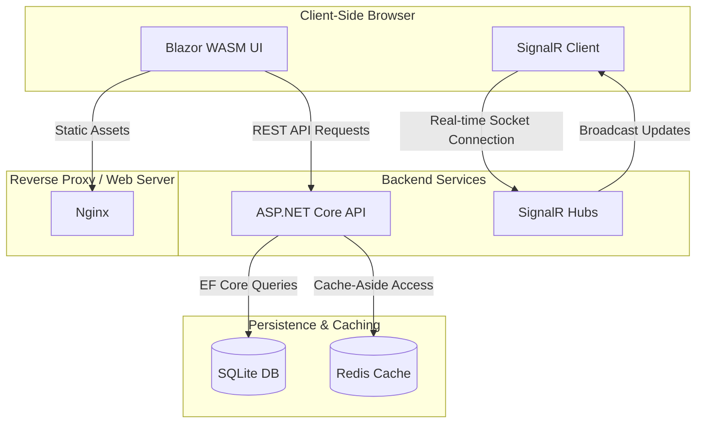

# UrlShortener - Architectural Overview

`UrlShortener` is a full-stack, cross-platform URL shortening and analytics tracking utility. It enables users to create compact, custom, or expiring links, redirect visitors instantly, and monitor visitor statistics (device, operating system, geolocation, and referrer) in real-time.

---

## Technical Stack

The application is structured as a modern client-server system using:
- **Backend**: ASP.NET Core API (.NET 10.0)
- **Frontend**: Blazor WebAssembly Single Page Application (SPA) (.NET 10.0)
- **Shared Libraries**: Shared DTOs and Socket payload contracts (.NET 10.0 Class Library)
- **Database**: SQLite (managed via Entity Framework Core)
- **Caching & Rate Limiting**: Redis (Distributed caching) & fixed-window rate-limiting middleware
- **Real-time Streaming**: ASP.NET Core SignalR (WebSockets)
- **Containerization**: Docker & Docker Compose (served via Nginx)

---

## Component Architecture

The application is decoupled into three main projects:

### 1. Frontend SPA (`UrlShortener.Frontend`)
A Blazor WebAssembly application compiled into static files and served using Nginx. It communicates asynchronously with the API using a preconfigured `HttpClient` and connects to backend SignalR hubs to update the dashboard dynamically when clicks occur.

### 2. Shared Library (`UrlShortener.Shared`)
Acts as a contract library sharing C# models, data transfer objects (DTOs), and socket communication entities between both compile targets.

### 3. Backend API (`UrlShortener`)
An ASP.NET Core Web API that manages the core lifecycle. It is structured into separate responsibilities:
* **Controllers**: Endpoints exposing authentication (`UserController`) and link management/redirection (`UrlController`).
* **Services**: Coordination layers managing shortening business logic, expiration rules, geolocation lookup, and cache policies.
* **Repositories**: Abstracted data access layers interfacing directly with SQLite.
* **Hubs**: SignalR communication gateways (`DashboardHub`) propagating telemetry updates.

---

## Key Design Patterns & Algorithms

### 1. Base62 URL Short-Code Generation
To convert long URLs into compact slugs, the system uses a **Base62 alphanumeric encoder**:
1. It hashes a combined payload of the database record `ID`, a fresh random `GUID`, and the `originalUrl` using **SHA-256**.
2. It extracts the first 8 bytes of the resulting hash and converts them into a positive 64-bit integer.
3. This integer is mathematically encoded into a base-62 representation using the URL-safe character set `[0-9A-Za-z]`.
4. If a collision is detected in the database, it regenerates a new hash until a unique code is created.

### 2. Cache-Aside Pattern
To maximize performance and protect SQLite from read-heavy redirect traffic, the backend implements a **Cache-Aside model**:
* When a visitor clicks a short link, the service first queries **Redis** using the pattern `originalurl:{slug}`.
* **Cache Hit**: Instantly redirects the user, bypassing database reads.
* **Cache Miss**: Queries the SQLite database, checks expiration/limits, saves the item back to Redis, and executes the redirection.
* **Invalidation**: On any updates or deletions, the Redis cache entries are evicted immediately to maintain data consistency.

### 3. Real-Time Telemetry Broadcasting
When a short link is visited, the backend processes telemetry, updates the database, invalidates the cache, and instantly pushes the new click count to all active dashboards using a **SignalR Hub connection**, bypassing the need for client-side polling.

### 4. Client Telemetry Parsing & Geolocation
* **Device Telemetry**: Uses `UAParser` to analyze incoming requests' `User-Agent` headers, extracting the operating system, device family, and browser version.
* **IP Geolocation**: An HTTP-based geolocation client translates client IP addresses into standard country codes.

### 5. API Rate Limiting & Auth
* **Rate Limiting**: Endpoint creation is protected by fixed-window rate-limiting middleware configured to prevent request floods.
* **Authentication**: Admin operations require a JWT Bearer token transmitted in HTTP request authorization headers.
